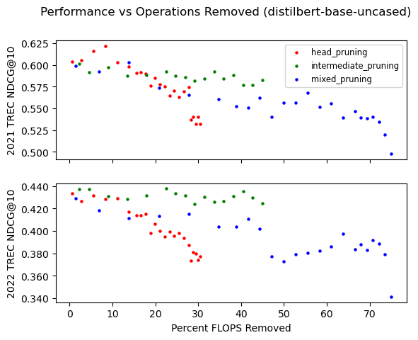

# Overview

This repo contains tools and training scripts for fine tuning and compressing re-ranking models for information retrieval (IR) in two stage retrieval systems. My goals are to explore the limits of applying pruning to re-ranking models, and IR models generally. This is of particular interest recently with this family of models providing inputs to retrieval augmented generation systems.

The table below is a quick summary of my results. In order to iterate quickly with my initial experiments I have so far only done continued pruning runs from the distilbert model, and I'm planning to do a set of runs for roberta-base in the future. I selected pruned checkpoints that kept performance roughly within 90% of the unpruned checkpoint's score. Timings and FLOPs were taken with synthetic worst case data (full context window every time). True performance would depend on the passage segmentation strategy for the corpus.

| Model       | S  | heads | hdim | '21 NDCG@10 | '21 MAP     | '22 NDCG@10 | '22 MAP     | T(CPU) (ms)  | T(GPU) (ms) | FLOPs (est.) |
| ----------- | -- | ----- | ---- | ----------- | ----------- | ----------- | ----------- | -----------  | ----------- | ------------ |
| roberta-base| 5M | 144   | 3072 | 0.6461      | 0.2598      | 0.4672      | 0.1009      | 30187 +- 575 | 3627 +- 34  | 4.83T        |
| distilbert  | 5M | 72    | 3072 | 0.6018      | 0.2477      | 0.4370      | 0.0982      | 14163 +- 129 | 1827 +- 17  | 2.42T        |
| distilbert  | 10M| 18    | 3072 | 0.5399      | 0.2311      | 0.3738      | 0.0866      | 8788 +- 131  | 1502 +- 10  | 1.75T        |
| distilbert  | 10M| 72    | 307  | 0.5827      | 0.2427      | 0.4248      | 0.0954      | 10287 +- 317 | 822 +- 17   | 1.33T        |
| distilbert  | 10M| 22    | 512  | 0.5382      | 0.2310      | 0.3831      | 0.0890      | 5508 +- 347  | 499 +- 21   | 0.74T        |

- Measures were taken for re-ranking to a depth of 100 candidates.
- CPU timings were taken on a 6 core, 3.70GHz CPU.
- GPU timings were taken on a 1080ti.
- FLOPs were calculated using [fvcore](https://github.com/facebookresearch/fvcore)

### Comparison with Dense Retrieval + Re-Ranking Systems

While these inference time speedups are impressive, dense retrieval systems with "late interaction" like [ColBERT](https://arxiv.org/abs/2004.12832) are going to be even quicker and also tend to give better results. They achive this by requiring a dense vector representation of the corpus to be computed up front to source candidates from. This comes with the downside of a slower and more expensive up front cost to index a new corpus, with the upside being a much higher recall within the set of candidates than a BM25 index, leading to higher possible scores by the reranker.

Going forward I'd be interested in applying the same techniques to dense retrievers, with the goal of reducing the up front indexing time.

# Methods
Training / eval data came from the [2023 TREC MS MARCOv2 passage ranking task](https://microsoft.github.io/msmarco/TREC-Deep-Learning).
I evaluated model checkpoints primarily with NDCG@10 against the '21 and '22 test sets using the trec_eval tool in the [Anserini toolkit](https://github.com/castorini/anserini). I ran a first pass fine tuning from the [RoBERTa](https://arxiv.org/abs/1907.11692) ([roberta-base](https://huggingface.co/roberta-base)) and [DistilBERT](https://arxiv.org/abs/1910.01108) ([distilbert-base-uncased](https://huggingface.co/distilbert-base-uncased)) checkpoints.

The first pass fine tuning followed the approach in [Passage ReRanking with BERT](https://arxiv.org/pdf/1901.04085.pdf) almost exactly, scaling the learning rate schedule down to the smaller batch sizes I can support on my hardware for the given model.

## Continued training with attention head pruning
Starting from the final checkpoint of the first pass I continued to train while incrementally pruning attention heads inspired by, but not strictly following [Voita et al.](https://arxiv.org/abs/1905.09418). Before pruning a head I measure a "confidence score" for each head, the mean of the max attention value output from the head over some number of samples, the head with the lowest score being removed. The model is exposed to further training samples before the next evaluation and pruning step. I modulated the learning rate to follow a cosine annealing schedule such that learning rate would be brought high again each time a head was pruned. This strategy has at least some support given that [learning rate rewinding](https://arxiv.org/abs/2003.02389) has outperformed standard pruning while fine tuning in other contexts. I held out the first layer's attention heads from pruning.


## Continued training with structured magnitude pruning
After the attention computation, the remaining linear layers contribute the most to inference time. In particular, the intermediate projections with a higher hidden dimension which are interleaved between attention layers in the common architectures.

I found that introducing unstructured sparsity and replacing the resulting layers with sparse matrices wouldn't improve runtime performance until a very high level (>97%) of sparsity was achieved.

I decided on structured pruning so the resulting projections could actually be re-sized to remove rows and columns, corresponding to "removing neurons" in the analogy. [Structured pruning in QA models](https://arxiv.org/abs/1910.06360) seemed to work well for all flavors of BERT and this is a fairly related task.

I used structured pruning based on the L1 magnitude of a hidden activation's inputs (row), again with a cyclic learning rate schedule. There are fancier differentiable gate approaches out there but this seemed to work well enough.

# Runs
Looking at evaluation performance for the three pruning schedules highlights the point that I fixed the pruning schedules such that the models reached a certain sparsity within the modules being pruned while all being exposed to the same number of training samples. I compared "head sparsity" with the sparsity of intermediate layers.

This makes comparing the methods somewhat tenuous - for example it would appear that pruning intermediate layers is generally cheaper in terms of cost to model performance than pruning attention heads. However this is probably an artifact of the experiment design. In terms of representational "channels" available to the model, head pruning scales more steeply than intermediate pruning, as it corresponds to more linear layers being pruned when you consider each of the K, Q, V and output transformations. In other words, my intermediate pruning runs were "gentler" to the model, allowing the model to see the same number of samples between pruning steps while making smaller, more gradual alterations to the models structure.

In the future I would like to design another set of runs that aligns global sparsity pruning rate, allowing for a more direct comparison.

## distilbert-base

I'm plotting them separately for readability but do note the lower axis range for 2022 NDCG. The TREC DL-22 test queries were sampled differently, with the intention of making the queries more difficult. This is certainly reflected in the distilbert results.




## roberta-base
WIP

# Reproducing these results

## Downloads

You can download the corpus and various splits of queries and qrels as suggested on the TREC DL track page. I organized the folders like:
```
~/path/to/data/msmarco-v2

       /triples.train.small.tsv
       /msmarco_v2_passage/

~/path/to/data/trec-msmarco-2023

       /2021_passage_top_100.txt
       /2021.qrels.pass.final.txt
       /2021_queries.tsv

       /2022_passage_top_100.txt
       /2022.qrels.pass.withDupes.txt
       /2022_queries.tsv
```

The corpus which should be extracted (22GB unzipped)
```shell
wget --header "X-Ms-Version: 2019-12-12" https://msmarco.blob.core.windows.net/msmarcoranking/msmarco_v2_passage.tar
```

Training triples, I only ever needed the 'small' file. (29GB unzipped):
```shell
wget --header "X-Ms-Version: 2019-12-12" https://msmarco.blob.core.windows.net/msmarcoranking/triples.train.small.tar.gz
```

The TREC DL-2021 validation set:
```shell
wget --header "X-Ms-Version: 2019-12-12" https://msmarco.z22.web.core.windows.net/msmarcoranking/2021_queries.tsv
wget --header "X-Ms-Version: 2019-12-12" https://msmarco.z22.web.core.windows.net/msmarcoranking/2021_passage_top100.txt.gz
wget --header "X-Ms-Version: 2019-12-12" https://trec.nist.gov/data/deep/2021.qrels.pass.final.txt
```

The TREC DL-2022 validation set:
```shell
wget --header "X-Ms-Version: 2019-12-12" https://msmarco.z22.web.core.windows.net/msmarcoranking/2022_queries.tsv
wget --header "X-Ms-Version: 2019-12-12" https://msmarco.z22.web.core.windows.net/msmarcoranking/2022_passage_top100.txt.gz
wget --header "X-Ms-Version: 2019-12-12" https://trec.nist.gov/data/deep/2022.qrels.pass.withDupes.txt
```


## Prefetch Validation Candidates
For simplicity of evaluation runs I prefetch the candidate passages from the collection for each of the TREC validation datasets.

```shell
python 01_prefetch_passages.py
       --corpus-dir data/msmarco-v2/msmarco_v2_passage
       --candidates-file data/trec-msmarco-2023/2021_passage_top100.txt
```

## Training
### Initial Training
You can start a new run from a base checkpoint or continue a run from a previous checkpoint, which will use optimizer and scheduler state from the checkpoint directory. Learning rate is optional and will default to the value used in Passage Re-Ranking With BERT.

```shell
python 02_train_initial.py
       --model_tag roberta-base
       --train_triples_file data/msmarco-v2/triples.train.small.tsv
       --output_dir models/roberta-base/initial-training/
       --eval_candidates_file data/trec-msmarco-2023/2021_passage_top100_hydrated.parquet
       --num_training_samples 5000000
       --num_checkpoint_samples 500000
```

### Continued training while pruning attention heads
Running head pruning in isolation on the next 5M pairs, from a checkpoint which has been trained already on the first 5M pairs:

```shell
python 03a_train_prune_att_heads.py
      --checkpoint_dir models/reranking/distilbert-base-uncased/initial-training/seen_5000000 
      --train_triples_file data/msmarco-v2/triples.train.small.tsv
      --output_dir models/reranking/distilbert-base-uncased/head-pruning-from-5000000/
      --eval_candidates_file data/trec-msmarco-2023/2021_passage_top100_hydrated.parquet
      --seen-pairs 5000000
      --target_sparsity 0.9
      --num_training_samples 5000000
```

### Continued training while pruning intermediate layers
Running intermediate structured pruning in isolation on the next 5M pairs, from a checkpoint which has been trained already on the first 5M pairs:

```shell
python 03b_train_prune_intermediates.py
      --checkpoint_dir models/reranking/distilbert-base-uncased/initial-training/seen_5000000 
      --train_triples_file data/msmarco-v2/triples.train.small.tsv
      --output_dir models/reranking/distilbert-base-uncased/intermediate-pruning-from-5000000/
      --eval_candidates_file data/trec-msmarco-2023/2021_passage_top100_hydrated.parquet
      --seen-pairs 5000000
      --target_sparsity 0.9
      --num_training_samples 5000000
```

### Continued training while using both pruning techniques
Running mixed pruning on the next 5M pairs, from a checkpoint which has been trained already on the first 5M pairs:

```shell
python 03c_train_prune_mixed.py initial
       --checkpoint_dir models/reranking/distilbert-base-uncased/initial-training/seen_5000000
       --train_triples_file data/msmarco-v2/triples.train.small.tsv
       --output_dir models/reranking/distilbert-base-uncased/mixed-pruning-from-5000000/
       --eval_candidates_file data/trec-msmarco-2023/2021_passage_top100_hydrated.parquet
       --seen-pairs 5000000
       --target_sparsity 0.9
       --num_prune_cycles 54
       --num_warmup_samples 100000
       --num_training_samples 5000000
```

The remaining scripts and notebooks are for removing pruning masks and reshaping the corresponding linear layers for models which had neuron pruning applied to them, and for generating plots.

